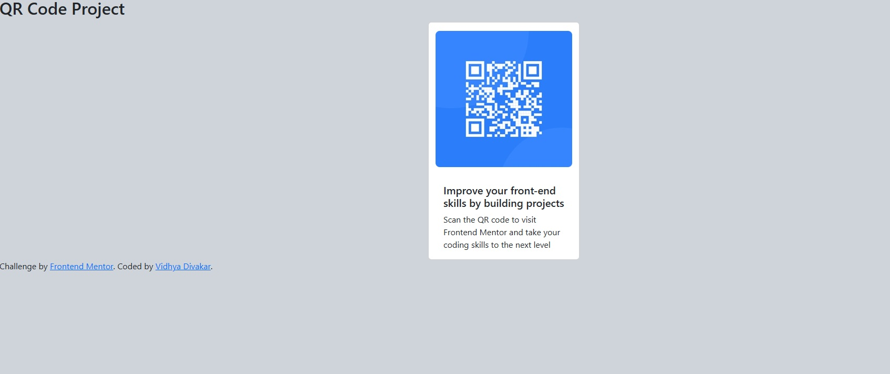

## Table of contents

* [Overview](#overview)
  * [Screenshot](#screenshot)
  * [Links](#links)
* [My process](#my-process)
  * [Built with](#built-with)
  * [What I learned](#what-i-learned)
  * [Author](#author)
* [Reflections](#reflections)

**Note: Delete this note and update the table of contents based on what sections you keep.**

---

## Overview

I have successfully completed the **QR Code Component challenge** from Frontend Mentor using  **Bootstrap 5** .

The project focuses on creating a card layout that displays a QR code, a heading, and description text. The goal was to practice **Bootstrap utilities for layout, spacing, and styling** while matching the design provided in the challenge.

### Screenshot

## My process

I started by analyzing the design and breaking it into  **main sections** : card container, QR image, title, and description.

Using  **Bootstrap classes** , I built the card layout quickly:

* Used **`card`** component for the card structure
* Used **`d-flex justify-content-center align-items-center`** to center the card on the page
* Used **spacing utilities** like `p-3` and `m-4` for padding and margins
* Applied **rounded classes** for border radius (`rounded-3`, `rounded-4`)

After the layout, I adjusted text styles and spacing using Bootstrap **typography and utility classes** to match the original design.

---

### Built with

* HTML5
* Bootstrap 5 (CDN)
* Flexbox utilities (`d-flex`, `justify-content-center`, `align-items-center`)
* Bootstrap spacing and border-radius utilities
* Google Fonts

---

### What I learned

Through this project I practiced how to:

* Quickly create a **responsive card layout** using Bootstrap
* Center elements vertically and horizontally using **Bootstrap flex utilities**
* Apply **padding, margins, and rounded corners** using Bootstrap utility classes
* Use **Bootstrap card components** for consistent styling
* Avoid writing custom CSS for small UI components when Bootstrap provides utilities

This project reinforced my  **understanding of Bootstrap classes and utility-first design** .

---

## Reflections

##### What challenges did you encounter when aligning your code with the design specifications?

One challenge was **centering the card perfectly on the page** without affecting other elements like the navbar. I also had to make sure the **QR image’s padding and rounded corners** were correct while keeping the card visually aligned. Understanding which **Bootstrap utilities** to use for spacing, flexbox, and rounded borders was key.

##### How can the feedback and community resources on Frontend Mentor help you improve as a developer?

Community solutions on Frontend Mentor help by showing **different ways to use Bootstrap and CSS utilities** for the same layout. Reviewing these solutions teaches  **cleaner markup, better class usage, and responsive layout techniques** . Feedback also helps me **match designs more accurately** and improve my overall frontend skills.
